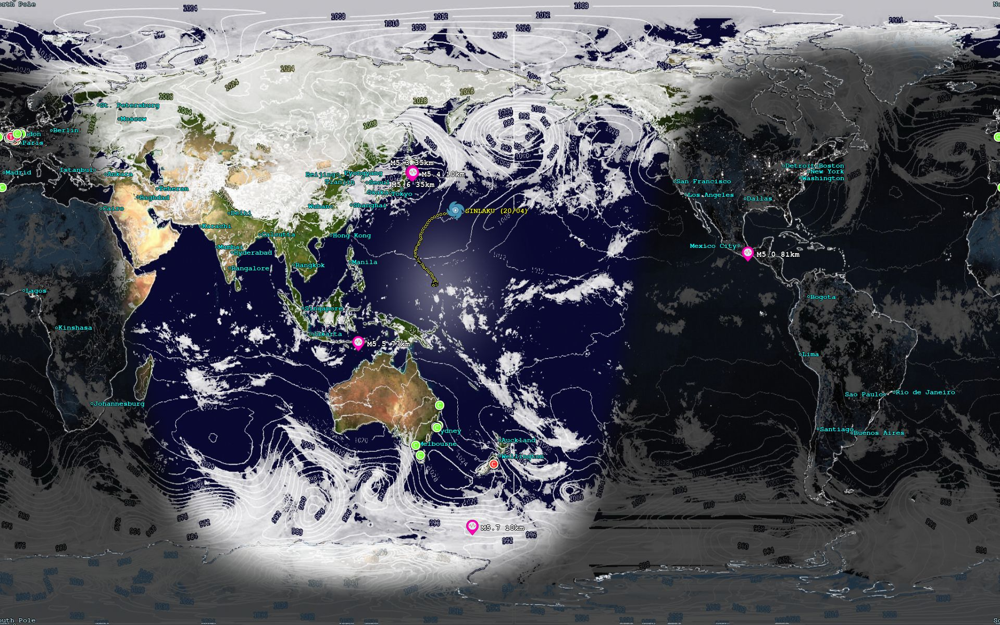

# Live World Map for Linux

## What is this?

A Docker container-based system that features a number of data acquisition scripts for Clouds, Isobars, Wind,
Rain, Lightning Strikes, Storm tracking, Earthquakes, Volcanoes, Sea Surface Temperature (SST), Ocean Currents
and Shipping before utilizing `xplanet` to render it all as an image of The World or part of it, for your desktop.

There is also a daemon which will monitor the folder this image is generated in, and update your desktop wallpaper
with what is essentially a live view of what's happening on the planet.

### Global example

### Regional example

## How do I use this?

### Prerequisites: Docker Installation

Before running this project, you must have Docker and Docker Compose installed on your system. 
For Ubuntu users, it is highly recommended to install Docker via the official Docker repository 
rather than the default apt archives to ensure you have the latest version compatible with 
modern systemd and container features. You can verify your installation by running 
docker --version in your terminal.

If you need some guidance on this a good place to look is
here https://www.digitalocean.com/community/tutorials/how-to-install-and-use-docker-on-ubuntu-20-04

Despite the '20-04' at the end of the link, this tutorial is also fine for later versions of Ubuntu.

To avoid having to use sudo with every command, ensure your user is added to the docker group. 
After installation, run `sudo usermod -aG docker $USER` and log out and back in for the changes 
to take effect. This will allow you to manage containers and orchestration seamlessly while 
working within the repository.

### For the ninjas: Clone the repository

    cd /your/preferred/workspace
    git clone -v https://github.com/paulwaite87/worldmap

After that, most things can be done via the Makefile. To see what is available:

    make help

The rest of this README is written for folks who are not developers!

### Quick Start
The recommended method of getting this up and running is to use the pre-built
images and the `worldmap-install.sh` script.

Begin by visiting the repo on Github (which is where you are if you are reading this!)
and downloading that file, or you can grab it in raw form directly using this link and then
save it yourself:
    https://raw.githubusercontent.com/paulwaite87/worldmap/refs/heads/master/worldmap-install.sh

You may have to make sure it is executable with

    chmod a+x worldmap-install.sh

Then just run that:

    ./worldmap-install.sh

By default this will install stuff in your home folder in a sub-folder called
`worldmap`.

If you want it to live somewhere else, then use this command instead:

    ./worldmap-install.sh /path/to/worldmap

Either of those will pull the pre-built images and will start everything running,
but most things will be disabled to begin with.

### Setting it up
The configuration file is called `worldmap.conf` and it lives in the `config` folder. 
You can either edit this file directly, or browse to `http://localhost:8180` to use
the configuration webpage there. If you do use that page, and save some changes they
will overwrite your `worldmap.conf` obviously. Which is absolutely fine, except
the original un-edited version that gets installed for you does have some quite 
informative comments scattered through it so to preserve those to look at anytime, 
you could make a backup copy of the file first.

Anyway, I would suggest first selecting a region on the landing page, setting up
your desktop geometry, and then in the `Atmospheric` tab just `Clouds` as a
starting point.

### Control
There is a control script for managing things.

    ./worldmap.sh

With no options, it will print out the commands it understands. The main one for
getting you desktop wallpaper updating would be:

    ./worldmap.sh map-start

And to stop it:

    ./worldmap.sh map-stop

See if that works for you. You should hopefully see your background change to a
map of the region you selected, with a clouds overlay.

### Logging
If you use the control script thusly:

    ./worldmap.sh logs

The logging will be tailed to your console. A healthy repeating cycle might look 
something like this. Obviously the below example shows shipping and weather 
scanner output, which you won't see out of the box unless you already acquired
API keys and enabled them.

    shipping_collector  | 2026-05-15 15:47:11,624 [INFO] worldmap.shipping_collector: Shipping Collector Service: Starting weighted global rotation
    weather_scanner     | 2026-05-15 15:47:11,931 [INFO] worldmap.weather_scanner: Weather Scanner Service: Starting regional scans.
    map_builder         | 2026-05-15 15:53:23,623 [INFO] worldmap.map_builder: Map-builder scheduler run started
    map_builder         | 2026-05-15 15:53:23,623 [INFO] worldmap.map_builder: Running scheduled task: 'clouds'
    map_builder         | 2026-05-15 15:53:23,808 [INFO] worldmap.map_builder: Running scheduled task: 'isobars'
    map_builder         | 2026-05-15 15:53:24,427 [INFO] worldmap.map_builder: Running scheduled task: 'precipitation'
    map_builder         | 2026-05-15 15:53:24,543 [INFO] worldmap.map_builder: Running scheduled task: 'currents'
    map_builder         | 2026-05-15 15:53:25,050 [INFO] worldmap.map_builder: Running scheduled task: 'composite'
    map_builder         | 2026-05-15 15:53:28,969 [INFO] worldmap.map_builder: Running scheduled task: 'storms'
    map_builder         | 2026-05-15 15:53:30,686 [INFO] worldmap.tasks.storms: Storm CSV cache is up to date.
    map_builder         | 2026-05-15 15:53:30,689 [INFO] worldmap.tasks.storms: Storm markers are up to date. Skipping.
    map_builder         | 2026-05-15 15:53:30,691 [INFO] worldmap.map_builder: Running scheduled task: 'lightning'
    map_builder         | 2026-05-15 15:53:30,794 [INFO] worldmap.tasks.lightning: Placed 27 strikes
    map_builder         | 2026-05-15 15:53:30,795 [INFO] worldmap.map_builder: Running scheduled task: 'quakes'
    map_builder         | 2026-05-15 15:53:31,696 [INFO] worldmap.map_builder: Running scheduled task: 'shipping'
    map_builder         | 2026-05-15 15:53:32,794 [INFO] worldmap.tasks.shipping: Shipping update complete. Placed 18463 ships in region.
    map_builder         | 2026-05-15 15:53:32,829 [INFO] worldmap.map_builder: Running scheduled task: 'xplanet'
    map_builder         | 2026-05-15 15:53:33,566 [INFO] worldmap.tasks.renderer: Successfully generated map: ./data/1778817212-regionmap.jpg
    map_builder         | 2026-05-15 15:53:33,566 [INFO] worldmap.map_builder: Map-builder scheduler run finished

The `map_builder` is the main process which puts together all the elements which get displayed 
on the map. This process is endlessly repeating, so your map will change through the 
day as the elements are updated.

### Regions
The database will be seeded with a few regions, which can be used to zoom in on where 
you want to populate elements on the map. You can add as many regions as you want. 

To add a region, we will need to get nerdy and insert data into your database. The
format of an SQL statement which will do just that is:

    INSERT INTO map_region (label, boundary) VALUES ('My Region', ST_MakeEnvelope(-7.346384, 42.490591, 10.854976, 51.487329, 4326));

Copy this somewhere that you can change it in an editor.

For the coords, go to https://tools.mofei.life/bbox#1/0/0 and navigate to wherever is 
centre of the region you want on the World map there. Zoom in and then pull a bounding-box 
with SHIFT-drag (TIP: ideally make it approx. 2:1 width:height). In the WGS84 box `Copy`
the bounding box coords and paste those (minus the square brackets) into your INSERT.
The co-ordinate ordering is already correct. Give your INSERT a new appropriate label,
(replacing 'My Region', then copy that SQL statement onto your clipboard and execute
this command:

    ./worldmap.sh db

That will get you into the World Map database PSQL shell. Paste your INSERT into that and
hit enter. Bingo, a brand new region. The World Map configurator should read your new region
and allow you to select it. The system will pull a dedicated region map at your specified
target geometry so there is no degradation of resolution when you display a small region
of the World. Perfect day/night maps care of NASA Blue Marble every time!

Just hit Ctrl-d to get out of the database.

### Obtaining an API Key for Shipping data
The `shipping_collector` needs an API Key to access the AIS stream carrying shipping messages.

To obtain one, head on over to https://aisstream.io/documentation on that page you will see 
a link to `Sign In` (https://aisstream.io/authenticate) which will ask you to sign in to their 
Github. Obviously if you don't have a Github account you will have to sign up for that first.

The process of obtaining the API Key is easy once you are signed in. There is a link `API Keys` 
and you can create one there. Copy the key, and then back in the root directory edit the
file named `.env` and replace the `AIS_API_KEY` placeholder there with your newly minted 
API Key. You will now be able to go into the World Map Configurator and on the `Show` tab 
in the `Background Processes` enable either or both the Shipping and Weather processes.

### Obtaining an API Key for Weather/Lightning Strikes
This is for the `weather_scanner` and it's a similar deal, but also easy. You just need to
create an account on https://openweathermap.org and the link to acquire an API Key is right
there on the homepage. Just be aware it will take some hours before the key is made active.

In your `.env` file do as above and put the key in for the `OPENWEATHER_API_KEY` setting.

Once the `weather_scanner` process is enabled and running, you will find that the table
in the database called `lightning_strikes` will acquire data, though it also gets culled
every few hours (`expiry_hours` setting in that section) so won't get too populated.

A `make status` command will show the number of strikes in each region.

### Shipping Data Acquisition
Ships broadcast data in the form of messages continuously at regular intervals. The main 
message they emit is a `PositionReport` which contains information as to latitude and longitude, 
current heading and speed. This message is usually fairly frequent. The other message of
interest to us is the `ShipStaticData` which has details of the ship itself such as name, 
size, draught, type and IMO number (International Maritime Organization number). This message 
is broadcast much less frequently, but the data is extremely useful to identify the type of 
vessel and its current loading state (draught).

The `shipping_collector` listens for both types of message and will gradually populate your
database `ships` table with them. It does this by slicing the globe up into 10 segments by
longitude, and then listening in each slice defined as a bounding box. The listen duration
varies according to how busy each slice is expected to be, based on shipping lanes and the
area of ocean it's looking at.

At any given instant either a `ShipStaticData` or `PositionReport` message might come in. If it's
a `PositionReport` the message is fairly specific to position, heading, speed etc. and contains
no details about the ship itself. The `shipping_collector` will look for an existing `ships`
record in our database with the same `mmsi` identifier, and if found add the new position info.
It also logs the position in the tracking table `ship_position` so we can display vessel tracks.
If it doesn't find an existing `ships` record it creates a `shadow` record with scant data about
the ship, basically just the name and the `mmsi` identifier. At some point we would hope to 
back-fill that data when a `ShipStaticData` is acquired for it.

The `map_builder` (see below) is independent of all this and just displays ships in the database 
which happen to be in the region(s) you have specified you want to display (or the whole World 
if you left that list empty).

One useful command for shipping is:

    ./worldmap.sh status

That will print out some status info about ships in each region, ship totals and also lightning
strikes per region.

### Map Overlays and Markers
Apart from shipping there are, of course, other elements to the map display. 
The full list is:

* Clouds
* Isobars
* Rainfall
* Wind speed & direction
* Sea surface temperature (absolute or anomaly)
* Ocean currents
* Wave height & direction
* Air temperature (absolute or anomaly)
* Lightning strikes
* Active storms
* Earthquakes
* Volcanoes
* Shipping
* Satellites

Each of these has its own configuration options.

Hopefully the settings in each section are fairly self-explanatory. The one which
is common to all is of course the `Enabled` flag which will turn the display of
each on or off.

In the web UI, the `Show` tab controls what gets shown on the map. If something is
disabled, then the following tabs will have that section hidden, to avoid cluttering
the interface.

These elements are also updated according to a frequency determined by a `Runs per day` 
setting. This is to restrict load on the remote servers, which only update their
data every few hours at most anyway.

You can, however, force the system to refresh the map using the following:

    ./worldmap.sh refresh-map

Though it should be noted that this will not necessarily result in data being refreshed
from the upstream source. Where possible the system will do a HEAD request to find out
if the remote data is newer than what we already have locally. If it isn't then we
will just refresh the map using the locally cached data.

If you really want a fresh start, then `sudo rm data/*` should do the trick! And if,
for some reason you want to refresh the regional maps then `sudo rm data/regions/*`.

### Some further notes

#### Volcanoes
Volcanoes are pretty much static day-to-day and can end up just cluttering up the map, 
so I generally don't display them. There are also a lot of them, depending on which
options you set in the configuration. One useful option for these is the option
`Specific volcano by name` if a particular volcano on the planet has a big eruption
and you want to display it. That field can take a comma-separated list too, if you
have several you want to display.

#### Storms
Storms will drop off the map when the `Expiry days` is exceeded. Quite often the NOAA
site will simply stop updating a storm if it loses strength and becomes a tropical low
or similar. This expiry stops it hanging around too long once the updates stop.

#### Shipping
If you select `Disc` ship icons there are basically two variants: Cargo (has a 'C' in
the middle) and Tankers ('T' in the middle). They each have their own default colours,
but these can also vary if the system detects their draught (loading) has decreased.

If you select `Arrows` for the ship icons then there is a colour code: red for tankers,
green for cargo, violet for passenger/other. Also the arrows will point in the direction
that the vessel is heading currently.

Tip: If you have `filter_ships_underway` set to True, shipping with speeds less than 
1.0 knots, or flagged as anchored or moored are NOT displayed. This avoids masses of ship
icons overlaying each other in port locations making a mess on the map.

There are also other filters in that section, so play around until you get the level of
detail you want.

#### Satellites
Plotting satellite paths is something XPlanet is famous for, and you can do that in this
package as well. Of course there are literally thousands of objects up there whizzing around
and about the Planet, not to mention the mega-clusters like Starlink etc. so I've just
populated a multi-select with a handful of the most popular ones you can display.

There is also a text box for you to add a comma-separated list of satellite names to cater
for a few you want which aren't in my list. Just be aware any you add have to come from
the groups I currently download from Celestrak: `resource`, `science`, `stations`, and 
`weather`. You can see what's in those by browsing to the following URL, replacing `{group}`
with one of those 4 group names:
    https://celestrak.org/NORAD/elements/gp.php?GROUP={group}&FORMAT=tle

### Wallpaper updates
The whole idea of this is to have a live desktop background. To update your wallpaper 
(fingers crossed!) execute the following command:

    ./worldmap.sh start-map

This kicks off a script which runs in the background, so to stop it:

    ./worldmap.sh stop-map

### Developer's corner
If you are a developer feel free to have a look at `wallpaper-update-daemon.py` for
more details. It works for my distro, but since I can't test yours, it might not. Feel
free to clone the repo, update the code and give us a pull request!
